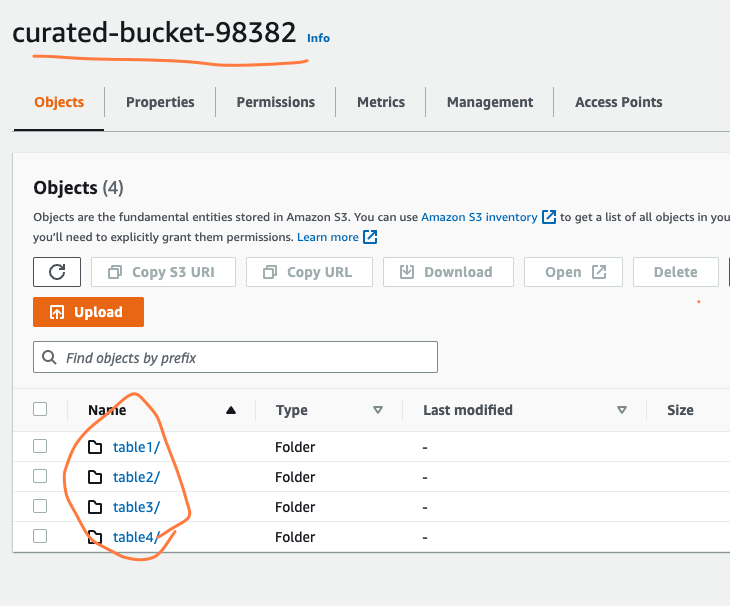

# s3-bq-transfer
하나의 S3 버킷에 테이블 이름이 prefix로 붙고 그 아래 데이터들이 있는 경우, 그리고 테이블의 수가 많으면 Console UI를 통해서 작업하기에는 많기 때문에 스크립트를 통해서 자동화 할 수 있다. 

## 관련문서
[Amazon S3 전송](https://cloud.google.com/bigquery/docs/s3-transfer?hl=ko)

## 준비작업
전체 실행은 Google Cloud Shell 에서 실행 추천. 

### 1. install aws cli 
[참고문서](https://docs.aws.amazon.com/cli/latest/userguide/getting-started-install.html)

aws s3 ls s3://bucketname 명령으로 prefix를 가져오는 명령을 실행하기 위해 설치
```
curl "https://awscli.amazonaws.com/awscli-exe-linux-x86_64.zip" -o "awscliv2.zip"
unzip awscliv2.zip
sudo ./aws/install
```

### 2. gcloud login 
사용자는 bigquery/Admin IAM role 이 필요하다. 
```
gcloud auth login
```

### 3. AWS bucket에 AmazonS3ReadOnlyAccess policy 적용
S3 문서를 읽기 위한 권한 

### 4. AWS user의 access key와 Secret를 생성해서 cli 로그인 
```
aws configure
```

### 5. BigQuery에 데이터셋 생성 [참고문서](https://cloud.google.com/bigquery/docs/datasets?hl=ko)
asia-northeast3 (seoul) 지역에 BigQuery Dataset 생성

### 6. 스크립트 준비 
```
git clone https://github.com/ilseokoh/s3-bq-transfer.git
chmod +x setup.sh
```

### 7. setup.sh 스크립트 상단에 변수 셋업

```
AWS_BUCKET_NAME=
PROJECT_ID=
DATASET=
AWS_KEY_ID=
AWS_SECRET_ACCESS_KEY=
```

## 실행 

```
./setup.sh
```

샘플결과 
테스트환경

```
❯ ./setup
declare -a table_arr='([0]="table1/" [1]="table2/" [2]="table3/" [3]="table4/" [4]="18:58:58")'
Create table1 ....
Table 'bigquery-demo-387504:s3_data.table1' successfully created.
Transfer configuration 'projects/537301467034/locations/asia-northeast3/transferConfigs/6485cd8e-0000-2756-a808-3c286d35780e' successfully created.
Create table2 ....
Table 'bigquery-demo-387504:s3_data.table2' successfully created.
Transfer configuration 'projects/537301467034/locations/asia-northeast3/transferConfigs/6486b0b2-0000-2d26-8770-3c286d356472' successfully created.
Create table3 ....
Table 'bigquery-demo-387504:s3_data.table3' successfully created.
Transfer configuration 'projects/537301467034/locations/asia-northeast3/transferConfigs/6485c46c-0000-2760-b71a-3c286d3556fa' successfully created.
Create table4 ....
Table 'bigquery-demo-387504:s3_data.table4' successfully created.
/Users/iloh/source/google-cloud-sdk/platform/bq/bq.py:18: DeprecationWarning: 'pipes' is deprecated and slated for removal in Python 3.13
  import pipes
Transfer configuration 'projects/537301467034/locations/asia-northeast3/transferConfigs/6485cf0c-0000-2f74-8284-3c286d3543e2' successfully created.
```


## S3 의 구조가 2 Depth인 경우 setup-2depth.sh 사용
S3가 아래와 같은 구조로 2 Depth 인 경우
```
aws s3 ls s3://$AWS_BUCKET_NAME --recursive
2023-06-13 19:31:04          0 abc/
2023-06-13 19:31:25          0 abc/table1/
2023-06-13 19:31:25    8178020 abc/table1/part-00000-68edc39c-2b84-4c9d-a7f7-6820148e7d46-c000.snappy.parquet
2023-06-13 19:31:25    8184929 abc/table1/part-00001-68edc39c-2b84-4c9d-a7f7-6820148e7d46-c000.snappy.parquet
2023-06-13 19:31:25    8188552 abc/table1/part-00002-68edc39c-2b84-4c9d-a7f7-6820148e7d46-c000.snappy.parquet
2023-06-13 19:31:25    8184704 abc/table1/part-00003-68edc39c-2b84-4c9d-a7f7-6820148e7d46-c000.snappy.parquet
2023-06-13 19:31:25          0 abc/table2/
2023-06-13 19:31:25    8168560 abc/table2/part-00004-68edc39c-2b84-4c9d-a7f7-6820148e7d46-c000.snappy.parquet
2023-06-13 19:31:25    8186276 abc/table2/part-00005-68edc39c-2b84-4c9d-a7f7-6820148e7d46-c000.snappy.parquet
2023-06-13 19:31:25    8186842 abc/table2/part-00006-68edc39c-2b84-4c9d-a7f7-6820148e7d46-c000.snappy.parquet
2023-06-13 19:31:25    8180305 abc/table2/part-00007-68edc39c-2b84-4c9d-a7f7-6820148e7d46-c000.snappy.parquet
2023-06-13 19:31:25    8179586 abc/table2/part-00008-68edc39c-2b84-4c9d-a7f7-6820148e7d46-c000.snappy.parquet
2023-06-13 19:31:10          0 def/
2023-06-13 19:31:49          0 def/table3/
2023-06-13 19:31:49    8184260 def/table3/part-00009-68edc39c-2b84-4c9d-a7f7-6820148e7d46-c000.snappy.parquet
2023-06-13 19:31:49    8174556 def/table3/part-00010-68edc39c-2b84-4c9d-a7f7-6820148e7d46-c000.snappy.parquet
2023-06-13 19:31:49    8171939 def/table3/part-00011-68edc39c-2b84-4c9d-a7f7-6820148e7d46-c000.snappy.parquet
2023-06-13 19:31:49    8184096 def/table3/part-00012-68edc39c-2b84-4c9d-a7f7-6820148e7d46-c000.snappy.parquet
2023-06-13 19:31:49          0 def/table4/
2023-06-13 19:31:49    8186224 def/table4/part-00013-68edc39c-2b84-4c9d-a7f7-6820148e7d46-c000.snappy.parquet
2023-06-13 19:31:49    8197825 def/table4/part-00014-68edc39c-2b84-4c9d-a7f7-6820148e7d46-c000.snappy.parquet
2023-06-13 19:31:49    8192127 def/table4/part-00015-68edc39c-2b84-4c9d-a7f7-6820148e7d46-c000.snappy.parquet
2023-06-13 19:31:49    8184263 def/table4/part-00016-68edc39c-2b84-4c9d-a7f7-6820148e7d46-c000.snappy.parquet
```

setup-2depth.sh 코드에서 PREFIX_DEPTH_1 확인


## Trouble Shoting 

### 이런 Warning 이 발생하는데 무시. 
```
/Users/iloh/source/google-cloud-sdk/platform/bq/bq.py:18: DeprecationWarning: 'pipes' is deprecated and slated for removal in Python 3.13
  import pipes
```

### Auth를 다시하라는 메시지와 함께 멈춤 
gcloud auth login 을 했음에도 실행 중간 (특히 tranfer를 만들때) URL을 웹 브라우저에 넣고 version_info를 요구할 때 
**하라는 데로 URL에 접속해서 로그인하고 나온 결과 token을 입력**
```
https://www.gstatic.com/bigquerydatatransfer/oauthz/auth?client_id=433065040935-rurojv99l326k2c1fpit6sfpj4v5m8tf.apps.googleusercontent.com&scope=https://www.googleapis.com/auth/bigquery&redirect_uri=urn:ietf:wg:oauth:2.0:oob&response_type=version_info
Please copy and paste the above URL into your web browser and follow the instructions to retrieve a version_info.
Enter your version_info here:
```

그럼에도 다시 또 물어보면 bq cli의 버그를 우회 해보자. 
1. US 지역에 BigQuery Dataset을 만든다. 
1. setup.sh의 DATASET을 수정한다. (US 로 만든 걸로)
1. setup.sh 실행. 과정에서 다시 같은 메시지(Enter your version_info here:)가 나오면 하라는데로 로그인해준다. 
1. 이건 임시방편이므로 실행이 되지 않게 (비용이 나가지 않도록) 클라우드 콘솔에서 BigQuery 메뉴에서 Transfer Service를 삭제한다. 
1. 다시 setup.sh 의 DATASET 을 원래 dataset으로 변경하고 다시 실행한다. 
